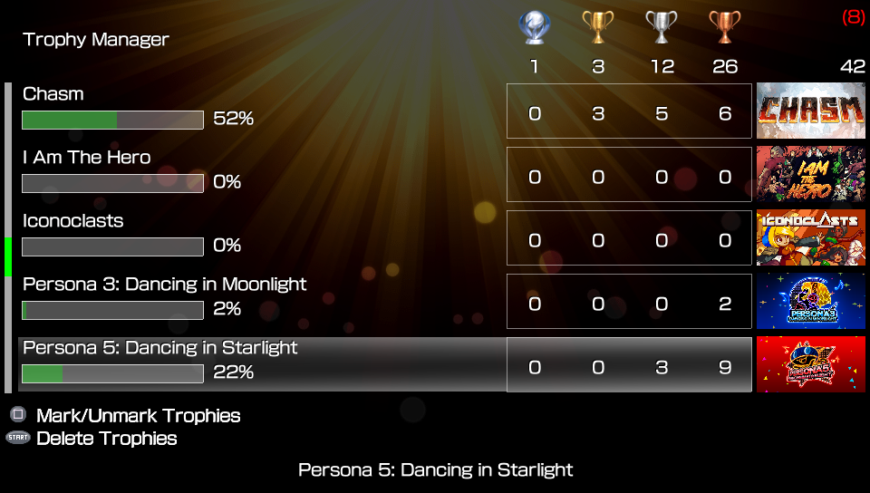
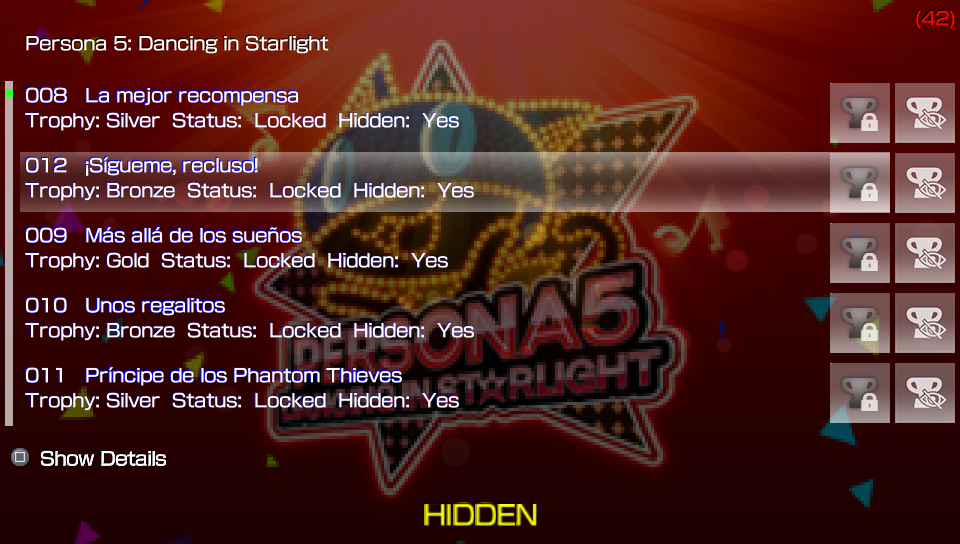
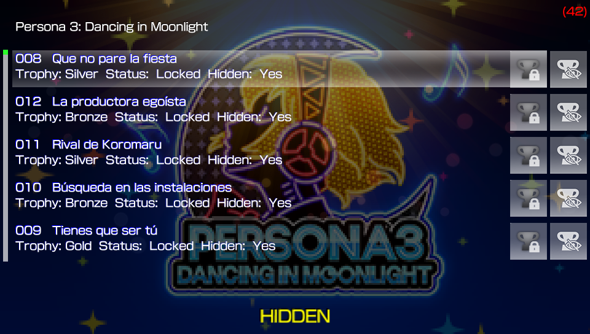

# Trophy Manager
** This app allows you to preview the trophies and their status for each game and delete trophies as desired.**

### Description ###
*This Homebrew could help you delete the game trophies you won't like to synch.*

## IMPORTANT ##
**Everytime a trophy Is deleted, the trophy app/bubble  must be launched to update the trophy db, we highly recomend you to disable the wifi in the PS Vita before launching the trophy app/bubble for this matter.**

### Changelog 1.03 ###
- Support for trophies in homebrews and ports. 

### Changelog 1.02 ###
- Support for custom font in ux0:data/ONETROPHY/font/font.pgf. 

### Changelog 1.01 ###
- Now you can open the Trophies application. 

### Changelog 1.00 ###
-Initial Version. 

### Controls ###
*Trophy Manager does recognize the accept/cancel buttons according to console region.*

*Main Screen*

- **Square:** Multi Selection. 
- **Start:** Delete selected trophies. 
- **Select:** Sort List: Title, Progress. 

*Trophy Screen*
- **Square:** To preview details for a hidden trophy. 
- **Select:** Sort List: Trophyid, Unlocked, Hidden. 

### NOTE: ###
*This app Is based from Trophax app, but Trophy Manager does not unlock trophies.*

### Credits ###
- Silica for his Trophax app
- Graphics By WZ-JK.

## Donation ##
In case you want to support the work of the team on the vita, you can always donate for some coffee. Any amount is highly appreciated:

